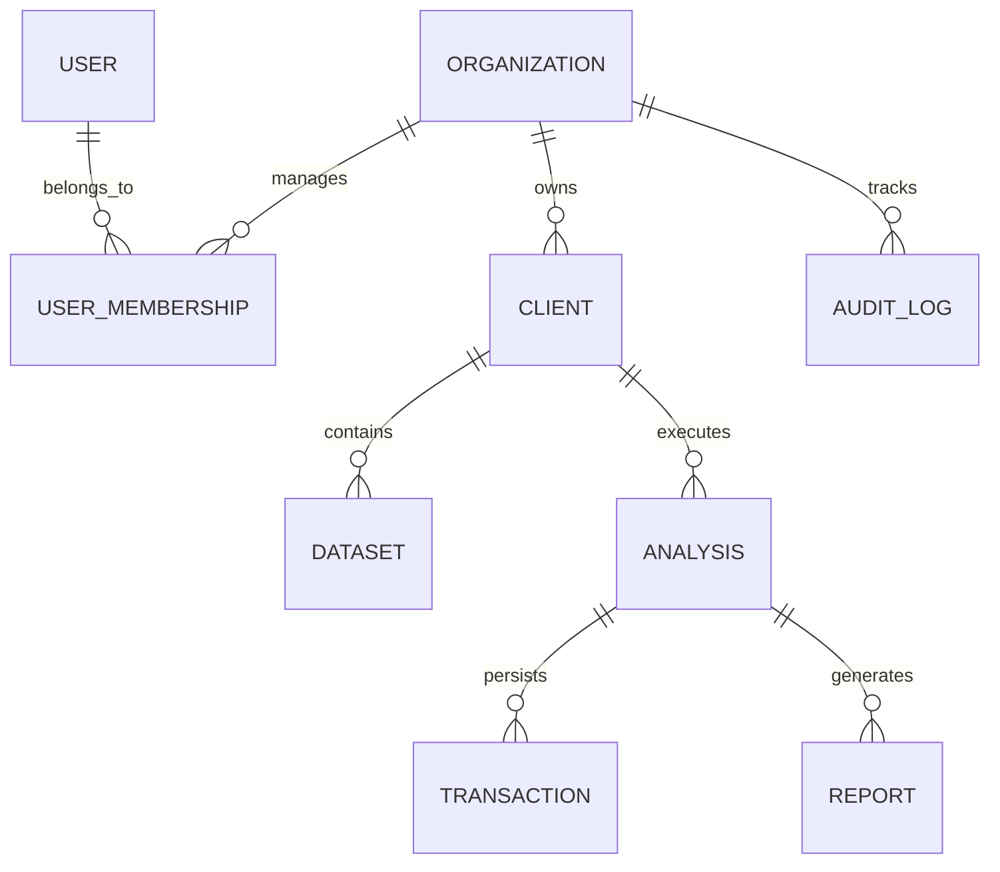

# Sentinel AI

### Enterprise AI Fraud Detection & Risk Intelligence Platform

[](file:///c:/Users/Zuraiz%20Malik/Desktop/Sentinel%20AI/backend/tests)
[](file:///c:/Users/Zuraiz%20Malik/Desktop/Sentinel%20AI/frontend/src/test)
[](file:///c:/Users/Zuraiz%20Malik/Desktop/Sentinel%20AI/frontend/tsconfig.json)
[](https://fastapi.tiangolo.com)
[](https://react.dev)
[](https://www.sqlalchemy.org)
[](https://shap.readthedocs.io)
[](LICENSE)

Sentinel AI is an enterprise-style AI fraud detection and risk intelligence platform engineered to ingest large-scale credit card transaction datasets, intercept high-risk financial attacks with mathematically optimized decision thresholds, explain model predictions using game-theoretic SHAP attributions, manage institutional client portfolios with strict multi-tenant isolation, enforce Role-Based Access Control (RBAC), and compile executive-ready PDF audit reports.

---

## Overview

Modern payment processors and financial institutions handle millions of credit card transactions daily, facing continuous automated attacks and sophisticated payment fraud. Detecting fraud requires analyzing highly skewed transaction streams, preventing statistical data leakage during feature engineering, optimizing decision thresholds beyond naive 50% probability cutoffs, providing explainable rationales to investigators, and isolating client data in compliance with financial regulations.

Sentinel AI addresses these requirements in an end-to-end, decoupled full-stack architecture operating on **localhost**.

---

## The Problem

Traditional fraud detection systems and baseline models frequently encounter four fundamental operational hurdles:
1. **Extreme Class Imbalance**: Real-world fraud rates typically range between $0.2\%$ and $0.6\%$ ($171:1$ imbalance). Naive accuracy metrics are deceptive, as a model that marks everything as legitimate achieves $>99.4\%$ accuracy while missing all financial losses.
2. **Data Leakage & Temporal Overfitting**: Applying preprocessing scalers or encoders across full datasets before partitioning leaks statistical parameters from future transactions into training sets, causing validation metrics to collapse on unseen live data.
3. **The Arbitrary 0.5 Decision Boundary**: Standard binary classifiers use an arbitrary $0.5$ probability threshold. On skewed distributions, this either creates massive false-positive queues that overwhelm human investigators or allows costly fraudulent transactions to slip through.
4. **The "Black-Box" Investigation Dilemma**: Compliance and regulatory frameworks (e.g., GDPR, FCRA) require institutions to explain why a specific transaction was declined or flagged for review.

---

## The Solution

Sentinel AI solves these challenges by providing:
- **Pre-Flight Data Auditing**: Evaluates file integrity, column schemas, class distributions, missing cell percentages, and duplicate records prior to model execution.
- **Leak-Free ML Pipeline**: Implements strict fit-on-train-only transformers with temporal partitioning, cyclical temporal encoding, Haversine geodesic distance calculation, and log-amount scaling.
- **Precision-Recall Threshold Optimization**: Sweeps the validation PR curve to identify the operational threshold ($\tau^* = 0.8255$) that maximizes $F_1$ score for imbalanced data.
- **Deterministic Risk Scoring (0 - 100)**: Maps fraud probabilities directly into standard enterprise risk tiers (`LOW`, `MEDIUM`, `HIGH`, `CRITICAL`).
- **Local SHAP Feature Attribution**: Computes single-transaction game-theoretic Shapley contributions on-demand, isolating positive risk escalators and negative risk mitigators.
- **Multi-Tenant Architecture & RBAC**: Enforces strict organization-level and client-level data isolation with `ORGANIZATION_ADMIN`, `ANALYST`, and `VIEWER` roles.
- **Executive PDF Reporting**: Uses ReportLab to compile multi-page audit reports with embedded benchmark matrices, confusion tables, and actionable operational recommendations.

---

## Key Features

- **Multi-Organization Architecture**: Dedicated organization workspaces with isolated membership, datasets, and models.
- **Institutional Client Management**: Manage multiple financial clients per organization with independent dataset repositories.
- **Dataset Ingestion & Pre-Flight Validation**: Validates CSV datasets up to 500 MB without raw data mutation.
- **Leak-Free Preprocessing**: Temporal train/validation/test splits with fit-on-train-only transformers and zero PII exposure.
- **Automated Model Benchmarking**: Compares Random Forest, Baseline Logistic Regression, and XGBoost classifiers.
- **Precision-Recall Curve Threshold Optimization**: Dynamically determines optimal decision boundaries ($\tau^*$).
- **Deterministic Risk Scoring**: Scales model probabilities into standard 0 - 100 risk bands.
- **Transaction-Level SHAP Explainability**: Slide-in investigation drawer with on-demand SHAP waterfall charts.
- **Server-Side Transaction Explorer**: Paginated, sortable, and filterable transaction query engine.
- **Multi-Scope PDF Reporting**: Generates Organization, Client, and Analysis PDF audit documents with two-pass `NumberedCanvas`.
- **Append-Only Security Audit Logging**: Chronological, immutable audit trail of administrative and investigative actions.
- **Dual Persistence Architecture**: In-memory `SessionStore` for rapid prototyping and asynchronous SQLAlchemy 2.0 (PostgreSQL / SQLite) for persistent multi-tenant storage.
- **Modern Responsive Dashboard UI**: Built with React 18, TypeScript, Tailwind CSS, and Recharts.

---

## Architecture

Sentinel AI follows a clean, decoupled full-stack architecture:

```mermaid
graph TD
    User([Fraud Analyst / Risk Officer]) <--> UI[React 18 + Vite + Tailwind Dashboard]
    
    subgraph FrontendLayer ["Frontend Layer (Port 5173)"]
        UI --> OrgView[Organization Portfolio & Client Management]
        UI --> MLView[Analysis Overview, Transactions & Analytics]
        UI --> Drawer[SHAP Investigation Drawer]
        UI --> PDFView[PDF Report Generator]
    end
    
    FrontendLayer <-->|"HTTP / REST (JWT Bearer)"| Gateway[FastAPI API Gateway - Port 8001]
    
    subgraph SecurityLayer ["Security & Multi-Tenant Core"]
        Gateway --> Auth[JWT Authentication & bcrypt Security]
        Gateway --> RBAC[Role-Based Access Control: Admin | Analyst | Viewer]
        Gateway --> TenantGuard[Tenant & Client Isolation Enforcer]
        Gateway --> AuditLogger[Append-Only Audit Log Dispatcher]
    end
    
    subgraph MLServiceLayer ["Machine Learning & Explainability Core"]
        TenantGuard --> Ingest[CSV Ingestion & Pre-flight Validator]
        Ingest --> Split[Temporal Train / Val / Test Partitioning]
        Split --> Preproc[Fit-on-Train Preprocessor & Feature Engineering]
        Preproc --> Models[Candidate Classifier Training: RF | LR | XGBoost]
        Models --> ThreshOpt[Precision-Recall Curve Threshold Sweep: tau*]
        ThreshOpt --> Scorer[Deterministic Risk Scoring: 0 - 100 Bands]
        Scorer --> SHAP[TreeExplainer Local Feature Attribution]
    end
    
    subgraph StorageLayer ["Persistence & Reporting Layer"]
        TenantGuard --> DB[("SQLAlchemy 2.0 (PostgreSQL / SQLite)")]
        TenantGuard --> PDF[ReportLab Multi-Page PDF Engine]
        DB --> Entities[Orgs | Clients | Datasets | Analyses | Transactions | Audit Logs]
        PDF --> FileStore[data/reports/ (NumberedCanvas)]
    end
```

---

## Multi-Tenant Architecture & Access Control

Sentinel AI enforces strict organization-level data isolation. All clients, datasets, machine learning analyses, transactions, reports, and audit logs are scoped to an `organization_id`. Cross-tenant queries are blocked at the API dependency layer.



### Role-Based Access Control (RBAC) Matrix

| Permission / Action | ORGANIZATION_ADMIN | ANALYST | VIEWER |
|---|:---:|:---:|:---:|
| View Organization & Client Dashboards | ✅ | ✅ | ✅ |
| View Historical Analyses & Transactions | ✅ | ✅ | ✅ |
| Run SHAP Transaction Explainability | ✅ | ✅ | ✅ |
| Download PDF Audit Reports | ✅ | ✅ | ✅ |
| Upload CSV Datasets | ✅ | ✅ | ❌ |
| Execute Machine Learning Analyses | ✅ | ✅ | ❌ |
| Generate New Audit Reports | ✅ | ✅ | ❌ |
| Create & Manage Clients | ✅ | ✅ | ❌ |
| Invite Members & Assign Roles | ✅ | ❌ | ❌ |
| View Security Audit Logs | ✅ | ❌ | ❌ |

---

## Machine Learning Pipeline

The Sentinel AI machine learning pipeline is structured into 11 distinct, leak-free phases:

1. **Dataset Inspection & Structural Pre-Flight**: Validates file size, row/column counts, missing values, duplicates, and binary target integrity without in-place mutation.
2. **PII Exclusion**: Removes sensitive personal identifiers (`cc_num`, `first`, `last`, `street`, `dob`) before matrix generation.
3. **Temporal Partitioning**: Performs chronological splitting into training, validation, and holdout test subsets.
4. **Fit-on-Train Preprocessing**: Fits scalers and encoders strictly on the training partition:
   - `RobustScaler`: Outlier-resistant scaling for continuous numerical features.
   - `OneHotEncoder`: Categorical encoding with `handle_unknown='ignore'`.
   - `SimpleImputer`: Median imputation for missing numeric values.
5. **Domain Feature Engineering**:
   - Geodesic Haversine distance ($\text{km}$) between cardholder coordinates and merchant coordinates.
   - Cyclical temporal sine-cosine transformations for hour of day and day of week.
   - High-risk night transaction binary indicator ($23:00 - 06:00$).
   - Logarithmic amount compression ($\log(1 + \text{amount})$).
6. **Candidate Model Training**: Trains candidate classifiers (Random Forest, Logistic Regression baseline, XGBoost) on the transformed training partition.
7. **Model Comparison**: Evaluates candidate models on the validation set using Precision-Recall AUC (PR-AUC) and ROC-AUC.
8. **Precision-Recall Threshold Optimization**: Sweeps validation thresholds from $0.01$ to $0.99$ to identify the decision threshold ($\tau^*$) that maximizes $F_1$ score.
9. **Holdout Test Evaluation**: Evaluates the selected winning model on the chronologically separated, unseen test set at the frozen threshold $\tau^*$.
10. **Deterministic Risk Scoring**: Scales predicted fraud probabilities into intuitive 0 - 100 scalar scores with standard risk bands.
11. **SHAP Explainability**: Builds a `TreeExplainer` on the winning model to compute local additive feature contributions on-demand.

---

## Models & Benchmark Results

Models were evaluated against the real-world [Kaggle Credit Card Fraud Detection Dataset](https://www.kaggle.com/datasets/kartik2112/fraud-detection) ($1,296,675$ training transactions and $555,719$ chronologically separated unseen test transactions):

| Model | Validation PR-AUC | Validation ROC-AUC | Validation Precision | Validation Recall | Validation F1 | Optimal Threshold ($\tau^*$) | Unseen Test PR-AUC |
|---|:---:|:---:|:---:|:---:|:---:|:---:|:---:|
| **Random Forest (Winner)** | **0.8817** | **0.9962** | **84.24%** | **80.91%** | **0.8254** | **0.8255** | **0.8189** |
| **Logistic Regression (Baseline)** | 0.2202 | 0.9561 | 35.29% | 43.21% | 0.3885 | 0.9996 | 0.1842 |

### Unseen Holdout Test Performance (`fraudTest.csv` — $N = 555,719$)
- **PR-AUC**: **0.8189**
- **ROC-AUC**: **0.9950**
- **Test Precision**: **80.24%**
- **Test Recall**: **75.52%** ($1,620$ out of $2,145$ fraud attacks intercepted)
- **Test F1 Score**: **0.7781**
- **False Positive Rate**: **0.07%** (only $399$ false alarms across $553,574$ legitimate transactions)

#### Unseen Test Confusion Matrix
| | Actual Fraud (1) | Actual Legitimate (0) |
|---|:---:|:---:|
| **Predicted Fraud (1)** | **True Positive (TP): 1,620** | **False Positive (FP): 399** |
| **Predicted Legitimate (0)** | **False Negative (FN): 525** | **True Negative (TN): 553,175** |

---

## Explainable AI (SHAP)

Sentinel AI integrates game-theoretic SHAP (SHapley Additive exPlanations) to demystify complex tree-based predictions for compliance officers and fraud investigators:

- **Base Value ($\mathbb{E}[f(x)]$ )**: The dataset background fraud probability expectation.
- **Positive Risk Factors (+)**: Feature values pushing the prediction toward fraud (e.g., transaction amount $>\$1,000$, night hour $02:30$, unusual merchant category, large geodesic distance).
- **Negative Risk Factors (-)**: Feature values mitigating risk (e.g., low dollar amount, domestic proximity, standard daytime hours).
- **Investigation Drawer**: Analysts can click any transaction in the Transaction Explorer to open the slide-in investigation drawer and review its exact SHAP waterfall attribution breakdown.

---

## Risk Intelligence & Scoring

Sentinel AI maps continuous model fraud probabilities into transparent scalar risk scores:

$$\text{risk\_score} = \text{round}(\text{fraud\_probability} \times 100, 2)$$

### Standard Enterprise Risk Tiers
- **`LOW` (0 - 20)**: Low risk; eligible for automated straight-through processing.
- **`MEDIUM` (20 - 50)**: Moderate risk; standard transaction velocity checks applied.
- **`HIGH` (50 - 80)**: Elevated risk; flagged for supervisory review and secondary authentication.
- **`CRITICAL` (80 - 100)**: Critical risk exceeding optimal decision threshold $\tau^*$; flagged for immediate containment and intervention.

---

## Security & Governance

Sentinel AI implements defense-in-depth security best practices:
- **Authentication**: Stateless JSON Web Tokens (HS256) with configurable expiration (`ACCESS_TOKEN_EXPIRE_MINUTES`).
- **Password Hashing**: Cryptographic password hashing using `bcrypt` with adaptive salt generation.
- **Multi-Tenant Isolation**: Database queries strictly filter on `organization_id`; cross-tenant access is rejected with HTTP 403/404.
- **PII Stripping**: Primary account numbers (`cc_num`), customer names, and street addresses are purged before vectorization.
- **Input Sanitization**: Pydantic v2 validation models on all endpoints with sanitized error messages.
- **File Validation**: Strict `.csv` extension verification, maximum file size limits (500 MB), and MIME-type enforcement.
- **Append-Only Audit Trail**: Immutable logging of administrative events, dataset uploads, analyses, and investigator actions.

---

## PDF Reporting Engine

Sentinel AI utilizes ReportLab to compile multi-page, executive-ready PDF audit reports across three scopes:

1. **Organization-Level Reports**: Summarizes institutional client risk rankings, aggregated fraud statistics, and overall financial exposure.
2. **Client-Level Reports**: Highlights client-specific transaction volumes, detected fraud losses prevented, and dataset inventory.
3. **Analysis-Level Reports**: Deep technical audit containing candidate model comparison tables, confusion matrices, top risk queues, and actionable operational recommendations.

Reports feature a dynamic two-pass `NumberedCanvas` (`Page X of Y`), embedded high-resolution charts, and strict exclusion of raw PII.

---

## Interactive Dashboard

The React 18 single-page application provides an enterprise fintech interface:

- **Organization Dashboard**: High-level portfolio KPIs, client risk matrix, and recent fraud analysis history.
- **Client Management & Detail**: Institutional client cards, client-specific dataset repositories, and metrics.
- **Analysis Overview**: Executive KPI summary, risk distribution donut chart, category fraud rate bars, 10-bin score histogram, and empirical findings.
- **Transaction Explorer**: Server-side paginated, sorted, and filtered transaction table with risk badges.
- **Investigation Drawer**: Slide-in modal rendering transaction-level SHAP waterfall charts on-demand.
- **Dataset Health & Model Architecture**: Pre-flight data quality metrics and model architecture specifications.
- **Reports & Downloads**: PDF audit report generation and instant browser downloads.
- **Settings & RBAC**: Organization member management and role assignments.

---

## Project Structure

```
Sentinel AI/
├── backend/
│   ├── app/
│   │   ├── api/
│   │   │   ├── deps.py                  # JWT auth & RBAC dependency injectors
│   │   │   └── v1/                      # REST endpoints (auth, orgs, clients, analyses, etc.)
│   │   ├── core/                        # Application configuration, security & exceptions
│   │   ├── db/                          # SQLAlchemy 2.0 session factory & Base model
│   │   ├── models/                      # SQLAlchemy models (User, Org, Client, Analysis, etc.)
│   │   ├── repositories/                # Async database repository access layer
│   │   ├── schemas/                     # Pydantic v2 validation schemas
│   │   ├── services/                    # Business logic & ML orchestration services
│   │   └── main.py                      # FastAPI application entrypoint & middleware
│   └── tests/                           # 72 automated pytest test suites
├── frontend/
│   ├── src/
│   │   ├── api/                         # Axios client & typed API endpoints
│   │   ├── components/                  # Common components, layout, investigation drawer
│   │   ├── context/                     # React Contexts (Auth, Workspace, Analysis)
│   │   ├── pages/                       # Dashboard views (Overview, Transactions, Reports, etc.)
│   │   ├── types/                       # TypeScript interfaces and API types
│   │   ├── App.tsx                      # Root component with ErrorBoundary & React Router
│   │   └── main.tsx                     # DOM mounting point
│   ├── package.json
│   ├── tsconfig.json
│   └── vite.config.ts
├── data/
│   ├── raw/                             # Local raw CSV datasets (fraudTrain.csv, fraudTest.csv)
│   ├── uploads/                         # Ingested client CSV files
│   └── reports/                         # Generated executive PDF reports
├── docs/                                # Technical architecture, portfolio guide & API documentation
├── requirements.txt                     # Python dependencies
├── alembic.ini                          # Alembic database migration configuration
├── .env.example                         # Local environment configuration template
└── README.md
```

---

## Technology Stack

| Category | Technology | Purpose |
|---|---|---|
| **Backend Framework** | FastAPI (Python 3.10+) | Asynchronous REST API, dependency injection, OpenAPI documentation |
| **Data Validation** | Pydantic v2 | Type validation, request/response serialization, sanitized errors |
| **ORM & Persistence** | SQLAlchemy 2.0 / Alembic | Async ORM, migration tracking, PostgreSQL / SQLite dual compatibility |
| **Machine Learning** | Scikit-Learn & XGBoost | Leak-free preprocessing, Random Forest, Logistic Regression, XGBoost |
| **Explainable AI** | SHAP | TreeExplainer for local transaction-level Shapley additive attributions |
| **PDF Generation** | ReportLab | Two-pass `NumberedCanvas` executive multi-page audit report compiler |
| **Frontend Framework** | React 18 | Declarative single-page application |
| **Language & Tooling** | TypeScript & Vite | Strict type safety, rapid HMR, optimized production bundling |
| **Styling & UI** | Tailwind CSS & Lucide Icons | Dark enterprise fintech design system, responsive layouts |
| **Data Visualization** | Recharts | Interactive SVG charts (Donut, Bar, Histogram, PR curves) |
| **Testing** | Pytest & Vitest | 72 backend test suites, 7 frontend component unit tests |

---

## Localhost Quick Start

### Prerequisites
- **Python**: Version 3.10 or higher
- **Node.js**: Version 18 or higher (with npm)
- **Git**

### Step-by-Step Setup (Windows PowerShell / CMD)

```powershell
# 1. Clone repository
git clone https://github.com/zoraizanwar/Sentinel-AI.git
cd "Sentinel AI"

# 2. Setup Python virtual environment
py -m venv .venv
.\.venv\Scripts\Activate.ps1

# 3. Install Python dependencies
py -m pip install --upgrade pip
py -m pip install -r requirements.txt

# 4. Configure local environment variables
copy .env.example .env

# 5. Start the FastAPI backend (Port 8001)
py -m uvicorn backend.app.main:app --host 127.0.0.1 --port 8001 --reload
```

In a second terminal:

```powershell
# 6. Install frontend dependencies & start dev server (Port 5173)
cd frontend
npm install
npm run dev
```

Open [http://localhost:5173](http://localhost:5173) in your browser.

> **Default Seed Credentials**:
> - Email: `admin@sentinel.ai`
> - Password: `SentinelAdmin2026!`
> *(A 1-click "Demo Credentials" button is also provided directly on the Login page).*

---

## Dataset Setup

Sentinel AI utilizes the standard [Kaggle Credit Card Fraud Detection Dataset](https://www.kaggle.com/datasets/kartik2112/fraud-detection) for benchmark evaluation.

To analyze your own datasets or run the benchmark locally:
1. Place `fraudTrain.csv` and `fraudTest.csv` inside the `data/raw/` directory.
2. Large raw CSV files ($>100\text{ MB}$) are gitignored by default to maintain repository cleanliness.
3. You can upload any CSV dataset with transaction columns (`amt`, `lat`, `long`, `merch_lat`, `merch_long`, `trans_date_trans_time`, `category`, `is_fraud`) directly through the web UI at `/upload`.

---

## Usage Workflow

```mermaid
flowchart LR
    A[1. Sign In / Register] --> B[2. Select Organization]
    B --> C[3. Select / Create Client]
    C --> D[4. Ingest CSV Dataset]
    D --> E[5. Pre-Flight Validation]
    E --> F[6. Execute ML Analysis]
    F --> G[7. Review Dashboard KPIs]
    G --> H[8. Explore Transactions]
    H --> I[9. Inspect with SHAP]
    I --> J[10. Generate PDF Report]
    J --> K[11. Review Audit Logs]
```



1. **Sign In**: Log in using the seeded administrator credentials or register a new workspace.
2. **Organization Portfolio**: Review aggregate metrics across monitored institutional clients.
3. **Client Repository**: Select or create a client institution (e.g. `Apex Financial`).
4. **Ingest Dataset**: Upload a transaction CSV file. The pre-flight validator audits structural health.
5. **Execute Analysis**: Train candidate models, perform threshold optimization, and persist risk scores.
6. **Executive Overview**: Inspect risk tier distributions, top risk categories, and score histograms.
7. **Transaction Explorer**: Filter transactions by risk band (`CRITICAL`, `HIGH`, `MEDIUM`, `LOW`) or amount.
8. **SHAP Investigation**: Click any transaction to open the slide-in drawer and view local risk factor contributions.
9. **Executive PDF Report**: Generate and download a formatted PDF audit report.
10. **Security Audit Log**: Review the append-only chronological log of all actions.

---

## Testing & Quality Assurance

Sentinel AI includes a complete automated test suite:

### Backend Test Suite (Pytest)
```powershell
py -m pytest backend/tests -v
```
**Results**: **72 passed, 0 failed** (100% pass rate).
- Multi-tenant isolation verification
- JWT authentication and RBAC permission checks
- Pre-flight dataset validation rules
- Leak-free ML preprocessor and feature transformers
- Model training, threshold optimization, and SHAP attribution
- ReportLab PDF compilation and streaming
- Asynchronous database operations

### Frontend Test Suite (Vitest)
```powershell
cd frontend
npm test
```
**Results**: **4 test files passed, 7 tests passed, 0 failed** (100% pass rate).

### TypeScript & Production Build
```powershell
cd frontend
npm run build
```
**Results**: **0 TypeScript compilation errors**, Vite bundle generated in `dist/`.

---

## Project Status

- **Release**: Sentinel AI v1.0.0 (Localhost Portfolio Release).
- **Hosting**: Localhost only (`127.0.0.1:8001` backend, `localhost:5173` frontend).
- **Verification**: Fully verified end-to-end with automated test coverage.

---

## Limitations

- **Localhost Execution**: Designed for local development, evaluation, and demonstrations; not deployed to public cloud infrastructure.
- **Dataset Storage**: Datasets are stored on local filesystem storage (`data/uploads/`) rather than distributed object storage (S3 / GCS).
- **Synchronous ML Execution**: Model training is orchestrated locally; large-scale distributed computing frameworks (Spark, Ray) are not utilized.

---

## Future Improvements

- **Cloud Deployment**: Containerized deployment with Kubernetes / ECS and CloudFront CDN.
- **Distributed Task Queues**: Asynchronous background job processing with Celery / Redis for multi-gigabyte dataset training.
- **Real-Time Webhook Alerting**: Automated incident alerts dispatched to Slack, PagerDuty, or webhook endpoints for critical risk spikes.
- **Model Drift Monitoring**: Real-time statistical distribution tracking (PSI, KS-test) to detect feature drift over time.
- **Cloud Object Storage**: S3 / GCS backend adapters for distributed dataset and PDF artifact retention.

---

## License

This project is licensed under the MIT License — see the [LICENSE](LICENSE) file for details.

---

## Author

**Zoraiz Anwar**
- GitHub: [@zoraizanwar](https://github.com/zoraizanwar)
- Project: [Sentinel AI](https://github.com/zoraizanwar/Sentinel-AI)
