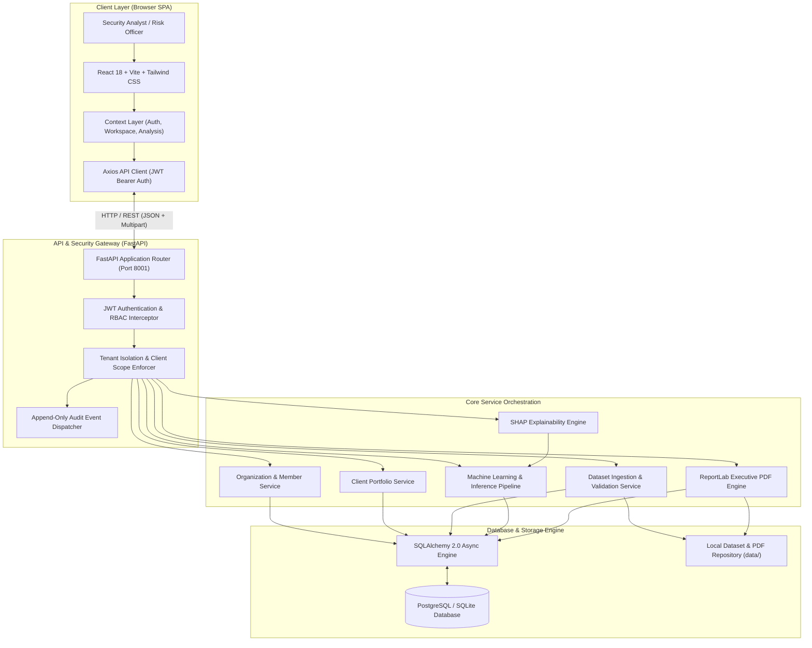
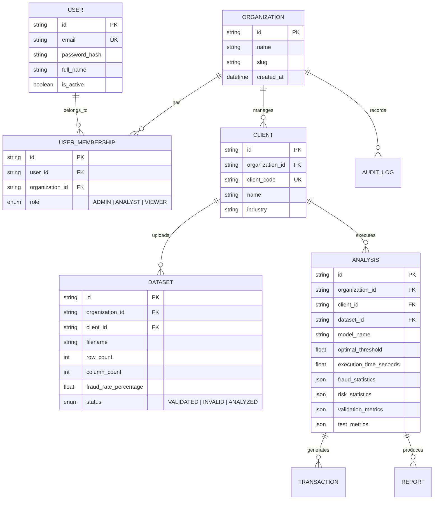
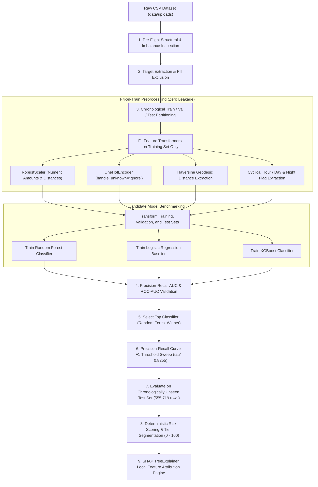
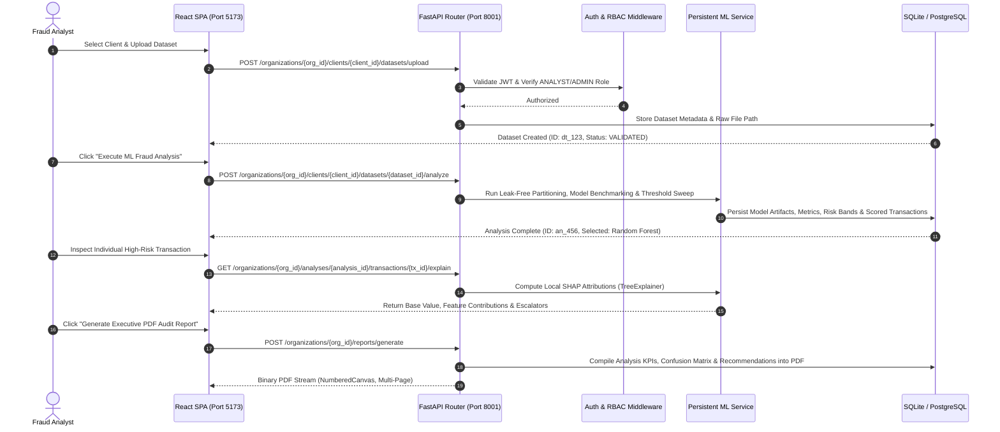

# Sentinel AI — System Architecture & Technical Specification

## 1. High-Level Architecture Overview

Sentinel AI is engineered as a decoupled, multi-tenant AI fraud detection and risk intelligence platform running locally. It provides leak-free machine learning pipelines, post-training threshold optimization, transaction-level SHAP explainability, fine-grained Role-Based Access Control (RBAC), multi-client portfolio management, append-only security audit logging, and executive PDF report generation.

---

## 2. Multi-Tenancy & Data Isolation Model

Sentinel AI enforces strict multi-tenant isolation across all entities in the platform. No user or organization can access, inspect, or query datasets, analyses, transactions, or audit logs belonging to another organization.

### Role-Based Access Control (RBAC) Matrix

| Permission / Action | ORGANIZATION_ADMIN | ANALYST | VIEWER |
|---|:---:|:---:|:---:|
| View Organization & Client Dashboards | ✅ | ✅ | ✅ |
| View Historical Analyses & Transactions | ✅ | ✅ | ✅ |
| Run SHAP Transaction Explainability | ✅ | ✅ | ✅ |
| Download PDF Audit Reports | ✅ | ✅ | ✅ |
| Upload CSV Datasets | ✅ | ✅ | ❌ |
| Run Machine Learning Analyses | ✅ | ✅ | ❌ |
| Generate New Audit Reports | ✅ | ✅ | ❌ |
| Create / Edit Clients | ✅ | ✅ | ❌ |
| Invite Members & Assign Roles | ✅ | ❌ | ❌ |
| View Security Audit Logs | ✅ | ❌ | ❌ |

---

## 3. Machine Learning Architecture & Leak-Free Pipeline

---

## 4. End-to-End Request Lifecycle

---

## 5. Security & Governance Boundaries

1. **Authentication & Token Lifecycle**:
   - Cryptographically signed JSON Web Tokens (HS256) with configurable TTL (`ACCESS_TOKEN_EXPIRE_MINUTES=480`).
   - Passwords hashed using standard `bcrypt` with adaptive cost parameters.
2. **Tenant Boundary Enforcement**:
   - Every database query dynamically joins against `organization_id`.
   - FastAPI dependencies (`require_org_member`, `require_org_admin`, `require_org_analyst`) verify membership before routing to business logic.
3. **PII and Data Protection**:
   - High-risk identifiers (`cc_num`, `first`, `last`, `street`, `dob`) are stripped before vectorization and never stored in model artifacts.
4. **Append-Only Audit Logging**:
   - Every state-changing operational action (`USER_REGISTERED`, `LOGIN_SUCCESS`, `CLIENT_CREATED`, `DATASET_UPLOADED`, `ANALYSIS_STARTED`, `REPORT_GENERATED`, `MEMBER_ADDED`) writes an immutable audit record containing timestamp, acting user ID, organization ID, action name, and metadata details.
