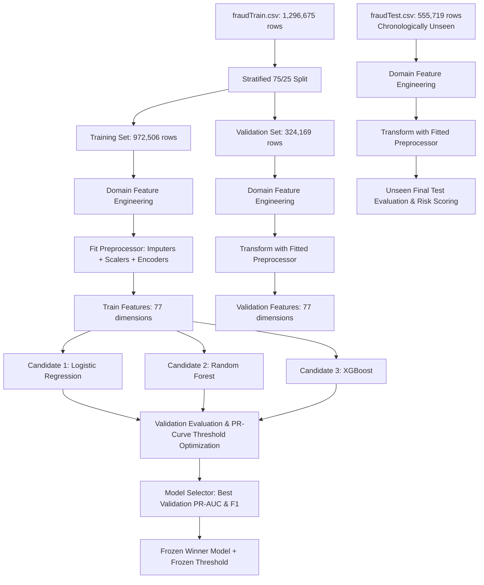

# Sentinel AI — Machine Learning Pipeline & Risk Intelligence Architecture

## 1. Pipeline Overview

Sentinel AI employs a modular, leak-free machine learning architecture designed specifically for severe class imbalance ($0.38\% - 0.58\%$ fraud prevalence) in high-throughput financial transaction ecosystems.

---

## 2. Dataset Split & Chronological Integrity Strategy

1. **Chronological Partitioning**:
   - `fraudTrain.csv` (1,296,675 transactions, Jan 2019 – Jun 2020) serves exclusively for model training, feature parameter fitting, and validation hyperparameter tuning.
   - `fraudTest.csv` (555,719 transactions, Jun 2020 – Dec 2020) serves exclusively as the **unseen holdout test set**. It is never accessed during preprocessing fitting, threshold selection, or model selection.
2. **Internal Validation Split**:
   - A stratified 75% Training ($N = 972,506$, 5,629 frauds) / 25% Validation ($N = 324,169$, 1,877 frauds) split is conducted on `fraudTrain.csv` with a fixed random seed (`random_state=42`).

---

## 3. Strict Data Leakage Prevention Protocol

- **Fit-on-Train-Only**: All numerical scalers (`RobustScaler`), missing value imputers (`SimpleImputer`), and categorical encoders (`OneHotEncoder`) are **fitted exclusively on the 75% Training partition**.
- **Transform-Only for Validation & Test**: Validation and test sets are processed strictly using `.transform()`.
- **Target Isolation**: Ground truth fraud labels (`is_fraud`) are removed from feature matrices before any transformation.
- **Identifier & PII Exclusion**: High-cardinality and PII identifiers (`Unnamed: 0`, `trans_num`, `cc_num`, `first`, `last`, `street`, `merchant`, `job`, `city`, `zip`) are excluded from model training to prevent memorization artifacts, and are preserved in a decoupled `metadata_df` for investigation.

---

## 4. Domain Feature Engineering

| Feature | Type | Engineering Methodology | Fraud Signal / Rationale |
|---|---|---|---|
| `distance_km` | Continuous Float | Haversine great-circle distance between customer residence `(lat, long)` and merchant terminal `(merch_lat, merch_long)` | Fraudulent transactions frequently originate at terminals physically distant from cardholders. |
| `customer_age_years` | Continuous Float | `(trans_date_trans_time - dob).days / 365.25` | Demographic risk profiling across age bands. |
| `hour_of_day` | Integer (0–23) | Extracted from transaction timestamp | Fraud surges during off-peak and night hours. |
| `day_of_week` | Integer (0–6) | Extracted from transaction timestamp | Weekend vs. weekday spending velocity. |
| `month` | Integer (1–12) | Extracted from transaction timestamp | Seasonal and holiday fraud spikes. |
| `is_night_hours` | Binary Flag (0/1) | Flagged if transaction occurs between 23:00 and 06:00 | Strong indicator for unauthorized automated draining. |
| `is_weekend` | Binary Flag (0/1) | Flagged if transaction occurs on Saturday or Sunday | Elevated retail and entertainment card-not-present fraud. |
| `amt` | Continuous Float | Transaction monetary value in USD | Primary indicator of financial exposure. |
| `log_amount` | Continuous Float | $\ln(1 + \text{amt})$ | Compresses heavy-tailed financial distributions for linear stability. |
| `category` | Nominal Categorical | One-Hot Encoded (14 merchant categories) | High fraud concentration in categories like `gas_transport`, `shopping_net`, `grocery_pos`. |
| `gender` | Nominal Categorical | One-Hot Encoded (`M`, `F`) | Baseline demographic feature. |
| `state` | Nominal Categorical | One-Hot Encoded (51 US jurisdictions) | Regional distribution accounting. |
| `city_pop` | Continuous Float | Population size of cardholder's city | Metropolitan vs. rural vulnerability. |

---

## 5. Candidate Models & Imbalanced Evaluation

### Candidate Configurations
1. **Logistic Regression (Baseline)**:
   - `solver="lbfgs"`, `class_weight="balanced"`, `max_iter=1000`, `random_state=42`.
2. **Random Forest Classifier (Ensemble Winner)**:
   - `n_estimators=100`, `max_depth=14`, `min_samples_split=10`, `min_samples_leaf=4`, `class_weight="balanced"`, `random_state=42`, `n_jobs=-1`.
3. **XGBoost (Gradient Boosting)**:
   - `n_estimators=100`, `max_depth=6`, `learning_rate=0.1`, `scale_pos_weight=171.75`, `random_state=42`, `n_jobs=-1`.

### Validation Performance Comparison ($N_{\text{val}} = 324,169$)

| Model Candidate | Validation PR-AUC | Validation ROC-AUC | Validation Precision | Validation Recall | Validation F1 | Validation Accuracy | Decision Threshold ($\tau^*$) |
|---|---|---|---|---|---|---|---|
| **Random Forest** *(Winner)* | **0.8817** | **0.9962** | **0.8424** | **0.8091** | **0.8254** | **0.9980** | **0.8255** |
| **Logistic Regression** | 0.2202 | 0.9561 | 0.3529 | 0.4321 | 0.3885 | 0.9921 | 0.9996 |

> **Key Architectural Insight**: Logistic Regression achieved a naive accuracy of $99.21\%$ despite missing $56.79\%$ of fraud cases ($F_1 = 0.3885$, $\text{PR-AUC} = 0.2202$), demonstrating why accuracy is disqualified as a primary metric in fraud detection.

---

## 6. Threshold Optimization Methodology

Rather than defaulting to $0.5$, the decision threshold $\tau^*$ is dynamically optimized on the validation split by sweeping the Precision-Recall curve to maximize the $F_1$ score:

$$\tau^* = \arg\max_{\tau} F_1(\tau) = \arg\max_{\tau} \frac{2 \cdot \text{Precision}(\tau) \cdot \text{Recall}(\tau)}{\text{Precision}(\tau) + \text{Recall}(\tau)}$$

- **Optimized Threshold**: $\tau^* = 0.8255$
- **Validation Precision at $\tau^*$**: $84.24\%$
- **Validation Recall at $\tau^*$**: $80.91\%$
- **Validation F1 at $\tau^*$**: $0.8254$

Once optimized on validation data, $\tau^*$ is **strictly frozen** for all subsequent test predictions and deployment inference.

---

## 7. Final Unseen Test Evaluation (`fraudTest.csv`)

Evaluated on $N_{\text{test}} = 555,719$ unseen transactions ($2,145$ fraud cases) at the frozen threshold $\tau^* = 0.8255$:

| Metric | Measured Value | Business Interpretation |
|---|---|---|
| **PR-AUC** | **0.8189** | Precision-Recall curve area under heavy imbalance. |
| **ROC-AUC** | **0.9950** | Discrimination ability between fraud and legitimate transactions. |
| **Precision** | **0.8024** ($80.24\%$) | Of all transactions flagged as fraud, $80.24\%$ were confirmed fraud. |
| **Recall** | **0.7552** ($75.52\%$) | Successfully intercepted $1,620$ out of $2,145$ fraud attacks. |
| **F1 Score** | **0.7781** | Harmonic mean of Precision and Recall on unseen test data. |
| **False Positive Rate (FPR)** | **0.0007** ($0.07\%$) | Only $399$ legitimate transactions interrupted out of $553,574$ legit transactions. |
| **False Negative Rate (FNR)** | **0.2448** ($24.48\%$) | Uncaptured fraud rate on unseen distribution. |

### Test Confusion Matrix
- **True Positives (TP)**: **1,620** (Fraud correctly intercepted)
- **False Positives (FP)**: **399** (Legitimate flagged)
- **True Negatives (TN)**: **553,175** (Legitimate approved)
- **False Negatives (FN)**: **525** (Fraud missed)

---

## 8. Deterministic Risk Scoring & Risk Bands

Every transaction receives a transparent risk score directly mapped from the model fraud probability:

$$\text{risk\_score} = \text{round}(\text{fraud\_probability} \times 100, 2)$$

$$\text{Risk Band} = \begin{cases}
\text{LOW}, & 0.00 \le \text{risk\_score} \le 20.00 \\
\text{MEDIUM}, & 20.01 \le \text{risk\_score} \le 50.00 \\
\text{HIGH}, & 50.01 \le \text{risk\_score} \le 80.00 \\
\text{CRITICAL}, & 80.01 \le \text{risk\_score} \le 100.00
\end{cases}$$

*Calibration Note*: Tree ensemble models output leaf vote distributions. These values represent direct model probability outputs rather than post-hoc calibrated probabilities (e.g. via Platt scaling or isotonic regression).

### Measured Risk Band Breakdown on Unseen Test Set ($N = 555,719$)

| Risk Band | Score Range | Transaction Count | Percentage | Recommended Operational Action |
|---|---|---|---|---|
| `LOW` | $0 - 20$ | 505,806 | $91.02\%$ | Auto-approve transaction. |
| `MEDIUM` | $21 - 50$ | 42,603 | $7.67\%$ | Standard monitoring / low-friction 2FA. |
| `HIGH` | $51 - 80$ | 5,160 | $0.93\%$ | Step-up biometric authentication / manual review. |
| `CRITICAL` | $81 - 100$ | 2,150 | $0.39\%$ | Immediate card freeze & fraud analyst investigation. |

---

## 9. Global Feature Importance

Top 10 features driving model predictions across the dataset:

| Rank | Feature Name | Normalized Importance | Domain Description |
|---|---|---|---|
| 1 | `amt` | **0.3331** ($33.31\%$) | Continuous monetary amount in USD. |
| 2 | `log_amount` | **0.3174** ($31.74\%$) | Log-transformed amount signal. |
| 3 | `hour_of_day` | **0.1296** ($12.96\%$) | Transaction hour (0-23). |
| 4 | `is_night_hours` | **0.0578** ($5.78\%$) | Binary flag for 23:00 - 06:00 execution. |
| 5 | `category_gas_transport` | **0.0204** ($2.04\%$) | Gas station / transit category code. |
| 6 | `category_shopping_net` | **0.0176** ($1.76\%$) | Online e-commerce shopping. |
| 7 | `category_grocery_pos` | **0.0156** ($1.56\%$) | In-person point-of-sale grocery store. |
| 8 | `customer_age_years` | **0.0145** ($1.45\%$) | Cardholder age derived from date of birth. |
| 9 | `category_misc_net` | **0.0089** ($0.89\%$) | Miscellaneous internet services. |
| 10 | `category_home` | **0.0086** ($0.86\%$) | Home improvement merchant category. |

---

## 10. Explainable AI & On-Demand Local SHAP

- **Global Attribution**: Extracted during model fitting and embedded in `ModelEvaluationSummary`.
- **On-Demand Local Attribution**: `TransactionExplainer` computes SHAP values on-demand when an analyst opens an investigation view.
- **Session Caching**: Computed local attributions are indexed by `trans_num` in `shap_cache` to ensure instantaneous response times on repeated inspections.
- **Top Attributions**: Deconstructs transaction risk into top 5 positive risk factors (increasing fraud score) and top 5 negative factors (supporting legitimacy).
